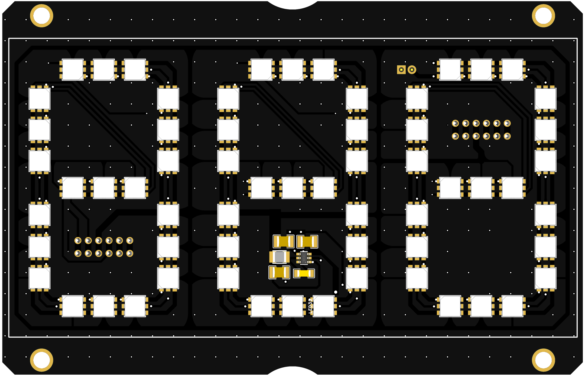

# Neopixel Seven Segment Display

A large, daisy chain-able, 3 digit seven-segment display board.

## Design
Constructed with [WS2813B-V5](https://media.digikey.com/pdf/Data%20Sheets/Seeed%20Technology/WS2813B_Ver.V5_10-20-19.pdf) "Intelligent control LED integrated light source[s]", there's no need for additional decoupling capacitors, reducing complexity.

The WS2813B-V5s include dual-signal wires (signal and backup signal) so any one pixel’s failure won't affect signal transfer.

## Features
- 63 total WS2813B-V5 LED pixels
- 3 WS2813B-V5 LED pixels per segment
- 2 6-pin spring clamp connectors
- 2A, 5V fixed output, synchronous buck converter with a wide input voltage range of 3.8V to 32V
- Backup NZR data signal to ground jumper pins

## Connector(s) Pinout
### H1
Pin | Function | I/O (Input/Output)
--- | --- | ---
VCC | Power (Switched) | I/O
EN | Buck converter Enable | I
DI | NZR Data Signal | I
5V | Fixed 5V supply | I/O
BI | Backup NZR Data Signal | I
GND | Ground Connection | I/O

### H2
Pin | Function | I/O (Input/Output)
--- | --- | ---
VCC | Power (Switched) | I/O
EN | Buck converter Enable | I
DO | NZR Data Signal | O
5V | Fixed 5V supply | I/O
BO | Backup NZR Data Signal | O
GND | Ground Connection | I/O

### J1
Pin | Function | I/O (Input/Output)
--- | --- | ---
BI | Backup NZR Data Signal | I
GND | Ground Connection | I/O

## Usage
- When powering a display with 5V the VCC pin can be left disconnected.
- Drive EN high to turn on the regulator and low to turn it off. Attach to VCC or leave open for automatic startup.
- The first display in any chain should have BI pulled to ground, this can be achieved be connecting jumper J1
